---
format:
  revealjs:
    css: style.css
    theme: black
    transition: fade
    slide-number: true
    code-line-numbers: false
    preview-links: auto
    keyboard: true
    touch: true
    help: true
    include-in-header: meta-tags.html
    link-external-newwindow: true
    footer: ""
revealjs-plugins:
  - fontawesome
keywords: ["claude-code", "ai-agents", "cli", "anthropic", "software-engineering"]
description-meta: "A comprehensive guide to using Claude Code effectively as a CLI agent. Learn about tools, slash commands, context management, subagents, planning mode, and more."
license: "CC0 1.0 Universal"
pagetitle: "Effective Claude Code Usage"
author-meta: "Indrajeet Patil"
date-meta: "2026-02-18"
lang: "en"
dir: "ltr"
image: "media/social-media-card.png"
image-alt: "Preview image for Effective Claude Code Usage presentation"
canonical-url: "https://www.indrapatil.com/effective-claude-code-usage/"
---

## Effective Claude Code Usage {style="margin-top: 1.2em;"}

:::: {.columns}

::: {.column width="62%"}

::: {style="color: #38bdf8; font-weight: 600; font-size: 0.95em; letter-spacing: 0.04em; margin-bottom: 1em;"}
From CLI to Cognitive Partner
:::

::: {style="font-size: 0.72em; color: #8b949e;"}
Indrajeet Patil &nbsp;·&nbsp; 2026
:::

::: {style="font-size: 0.65em; color: #8b949e; margin-top: 2em;"}
Source code on [GitHub](https://github.com/IndrajeetPatil/effective-claude-code-usage/)
:::

:::

::: {.column width="38%"}

::: {.terminal-box}
<pre><code>$ claude
✓ Claude Code v1.x

# Your AI pair programmer
# in the terminal

&gt; How can I help?
</code></pre>
:::

:::

::::

## What you'll learn {.smaller}

:::: {.columns}

::: {.column width="55%"}

::: {style="font-size: 0.88em;"}
- **Agents vs chatbots** — what Claude Code actually is
- **Tools** — what Claude can call and why it matters
- **Slash commands** — session control and automation
- **Context window** — what fills it and how to manage it
- **CLAUDE.md** — persistent project memory
- **Subagents** — parallelising complex work
- **Planning mode** — explore before you edit
- **Hooks** — automate validation at every lifecycle event
- **Prompting** — intent over instructions
- **CLI vs MCP** — token efficiency
- **Git worktrees** — parallel Claude sessions
:::

:::

::: {.column width="45%"}

::: {.card-green .card-compact style="font-size: 0.88em;"}
**Goal** · turn Claude Code from a smart autocomplete into a capable cognitive partner for complex engineering tasks.
:::

::: {.card-subtle .card-compact style="margin-top: 0.5em; font-size: 0.82em;"}
**Prerequisite** · Claude Code installed; you can run `claude` in a terminal.
:::

:::

::::

# What Is Claude Code?

> *"It's not a chatbot in a terminal. It's an agent that reads, writes, searches, and executes — and loops until the task is done."*

## Claude Code is a CLI Agent {.smaller}

:::: {.columns}

::: {.column width="50%"}

::: {.card-subtle .card-compact style="margin-bottom: 0.4em; font-size: 0.85em;"}
**CLI-first** · runs in your terminal, next to your shell, files, and Git history
:::

::: {.card-subtle .card-compact style="margin-bottom: 0.4em; font-size: 0.85em;"}
**Agentic** · not one-shot Q&A — loops: perceive → plan → act → observe → repeat
:::

::: {.card-subtle .card-compact style="margin-bottom: 0.4em; font-size: 0.85em;"}
**Tool-using** · reads files, writes code, runs bash, searches the web, spawns subagents
:::

::: {.card-blue .card-compact style="font-size: 0.82em;"}
**Key insight** · the model decides *which* tools to use, *in what order*, and *how many times*.
:::

:::

::: {.column width="50%"}

::: {.terminal-box}
<pre><code>$ claude "add unit tests
  for src/auth.ts"

● Reading src/auth.ts
● Scanning test patterns
● Writing tests/auth.test.ts
● Running: npm test

✓ 12 tests passing
</code></pre>
:::

:::

::::

# Agents vs. Everything Else

> *"The difference between a chatbot and an agent is the difference between giving advice and doing the work."*

## Intelligence Spectrum {.smaller}

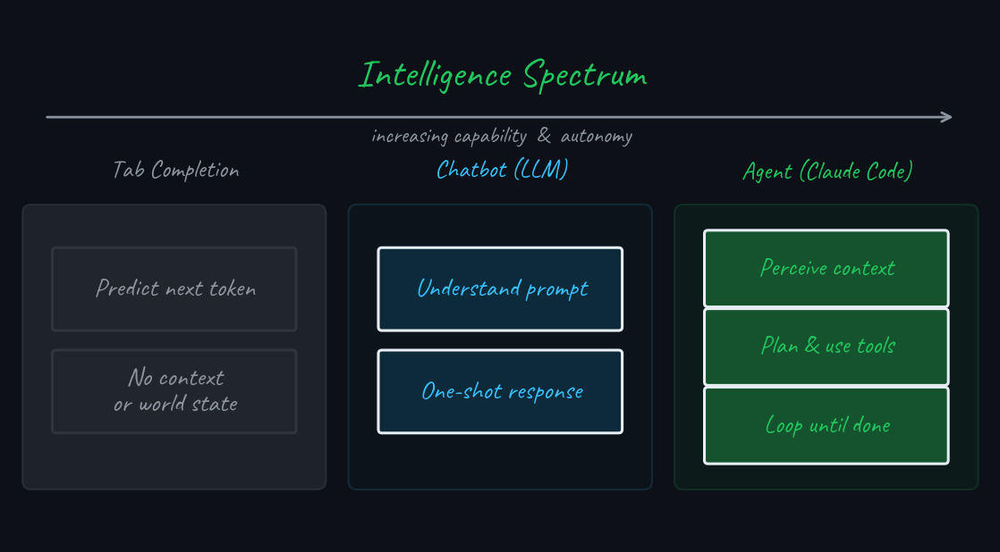{fig-align="center" fig-alt="Three-column diagram showing the intelligence spectrum from tab completion to chatbot to agent"}

## ReAct Agent Loop {.smaller}

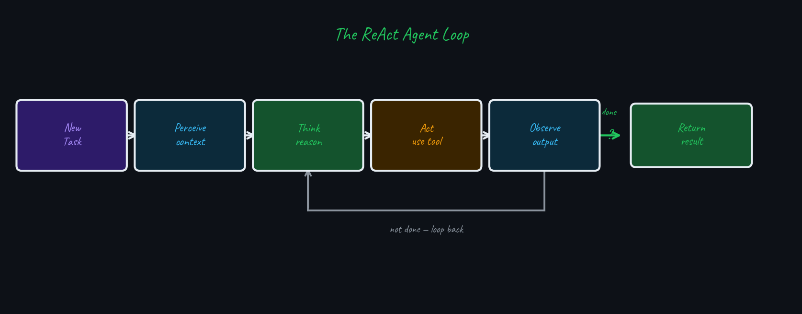{fig-align="center" fig-alt="Diagram showing the ReAct agent loop: perceive, think, act, observe, repeat"}

::: {.card-amber style="font-size:0.82em; margin-top:0.4em;"}
Claude Code can run 10–100+ tool calls per turn, reading test output, fixing errors, and re-running until done.
:::

# Tools & Capabilities

> *"A tool is a function the model can call. The model decides when — and how many times."*

## Tool Ecosystem {.smaller}

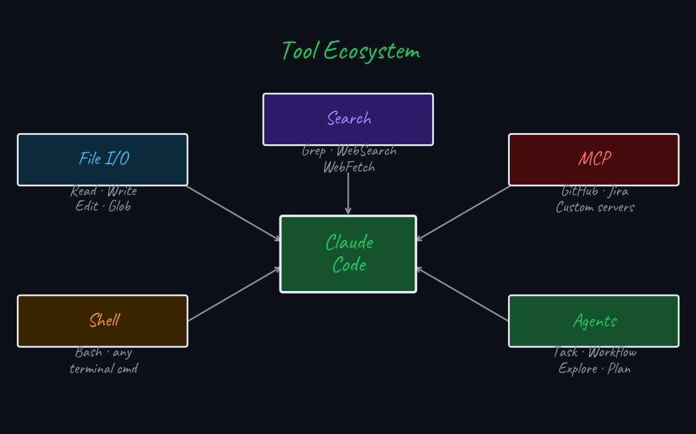{fig-align="center" fig-alt="Hub-and-spoke diagram showing Claude Code connected to File I/O, Shell, Search, Agents, and MCP tools"}

## Tool Categories {.smaller}

| Category | Enables |
|----------|---------|
| **File I/O** | Read any file; create or surgically modify code |
| **Pattern Search** | Find files by name; search content by regex |
| **Shell** | Run tests, git, npm, docker — any terminal command |
| **Web** | Fetch docs, read changelogs, search answers |
| **Agents** | Spawn isolated subagents for parallel work |
| **MCP** | GitHub PRs, Jira tickets, Postgres, and more |

::: {.card-blue .card-compact style="font-size:0.78em;"}
**Permission model** · dangerous operations (file deletion, git push) require explicit user approval. You control the blast radius.
:::

# Slash Commands

> *"Slash commands are the control panel for your session."*

## Slash Commands — Session & Automation {.smaller}

:::: {.columns}

::: {.column width="50%"}

**Session & Context**

| Command | Purpose |
|---------|---------|
| `/clear` | Reset conversation history |
| `/compact` | Compress history, keep summary |
| `/memory` | Edit CLAUDE.md files |
| `/status` | Show context window usage |
| `/cost` | Show token cost so far |

:::

::: {.column width="50%"}

**Automation**

| Command | Purpose |
|---------|---------|
| `/init` | Generate CLAUDE.md for this repo |
| `/review` | Code review current changes |
| `/pr` | Open a pull request |

::: {.card-amber .card-compact style="font-size:0.78em; margin-top:0.8em;"}
**`/compact`** is your best friend in long sessions — summarises history while preserving decisions.
:::

:::

::::

## Slash Commands — Control & Modes {.smaller}

:::: {.columns}

::: {.column width="50%"}

**Control & Meta**

| Command | Purpose |
|---------|---------|
| `/help` | List all commands |
| `/doctor` | Diagnose config issues |
| `/model` | Switch Claude model |

:::

::: {.column width="50%"}

**Modes**

| Command | Purpose |
|---------|---------|
| `/plan` | Enter planning-only mode |
| `/fast` | Toggle faster output (same Opus model) |

:::

::::

# Context Window

> *"The context window is finite. What's in it decides what Claude can reason about."*

## What Fills the Context? {.smaller}

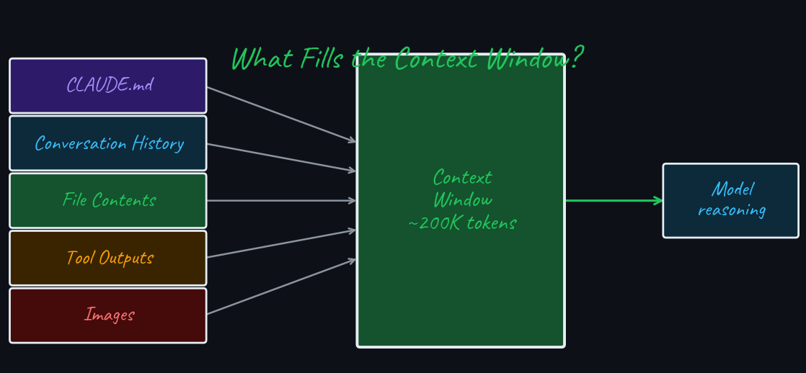{fig-align="center" fig-alt="Diagram showing five inputs flowing into the context window: CLAUDE.md, history, files, tool outputs, images"}

:::: {.columns}

::: {.column width="50%"}
::: {.card-amber .card-compact style="font-size:0.78em;"}
**Fills fast** · large tool outputs (full files, verbose logs) consume tokens rapidly.
:::
:::

::: {.column width="50%"}
::: {.card-green .card-compact style="font-size:0.78em;"}
**Fix** · use `/compact`, limit reads to relevant files, and trim bash output.
:::
:::

::::

# CLAUDE.md

> *"CLAUDE.md is persistent memory — what Claude should always know, even after `/clear`."*

## How CLAUDE.md Is Loaded {.smaller}

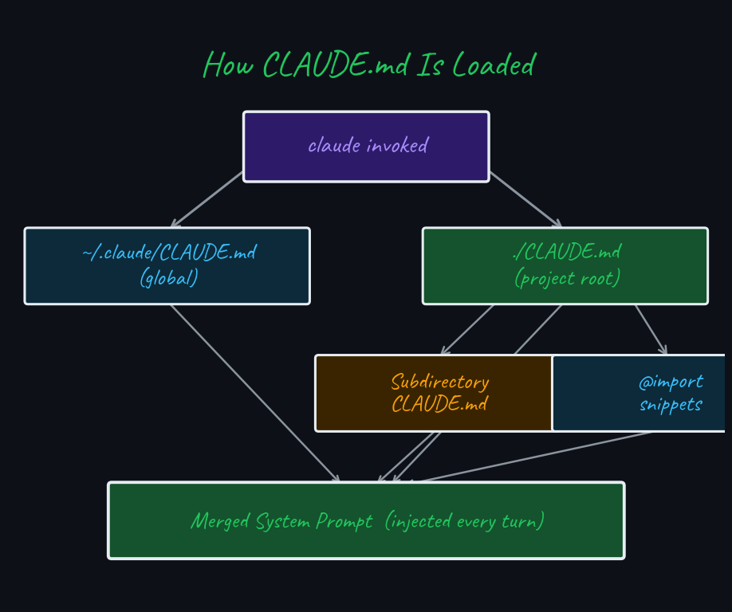{fig-align="center" fig-alt="Diagram showing how global, project-root, subdirectory CLAUDE.md files and @imports merge into the system prompt"}

## CLAUDE.md Anatomy {.smaller}

:::: {.columns}

::: {.column width="60%"}

::: {.terminal-box}
<pre><code># My Project CLAUDE.md

## Stack
TypeScript monorepo, Node 22, pnpm

## Conventions
- ESM only (no require())
- Tests: Vitest + @testing-library
- Branch: feat/&lt;ticket&gt;-description

## Commands
- Test:  pnpm test
- Build: pnpm build

## Never
- Push directly to main
- Commit .env files
</code></pre>
:::

:::

::: {.column width="40%"}

::: {.card-green style="font-size:0.85em;"}
**Auto-generate**

Run `/init` in any repo — Claude inspects the codebase and writes a CLAUDE.md for you. Edit it to add conventions and "never do" rules.
:::

::: {.card-subtle style="font-size:0.82em; margin-top:0.6em;"}
**It compounds** · add a rule once, Claude follows it forever.
:::

:::

::::

# Subagents

> *"Why do one thing sequentially when you can do four in parallel?"*

## Subagent Orchestration {.smaller}

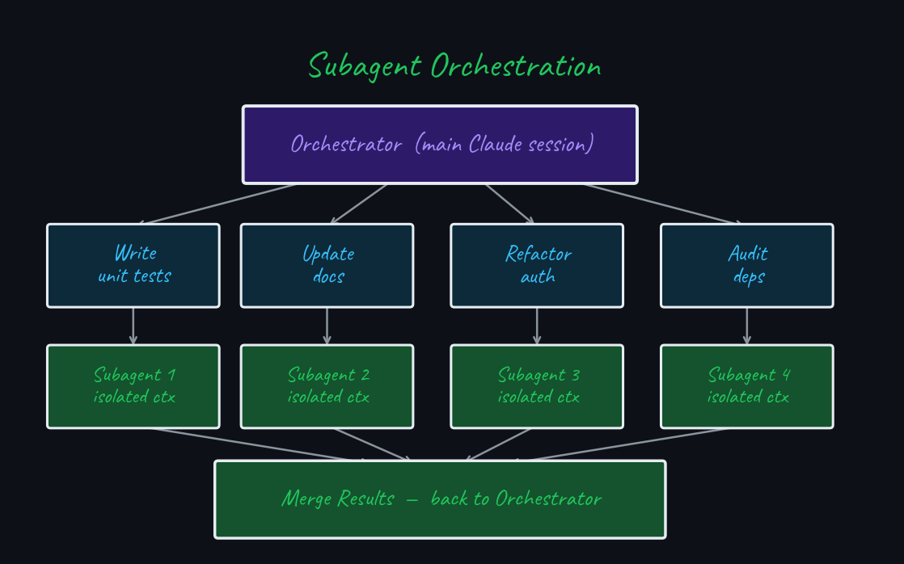{fig-align="center" fig-alt="Diagram showing orchestrator fanning out to four parallel subagents and merging results"}

## When to Use Subagents {.smaller}

:::: {.columns}

::: {.column width="50%"}

::: {.card-green .card-compact}
[**Use when**]{style="font-size:0.95em;"}

- Independent tasks across different modules
- Context isolation is an asset
- Large codebase exploration
:::

:::

::: {.column width="50%"}

::: {.card-amber .card-compact}
[**Avoid when**]{style="font-size:0.95em;"}

- Sequential dependencies between tasks
- Shared files risk merge conflicts
- Task is simple or needs one coherent decision
:::

:::

::::

::: {.card-blue .card-compact style="font-size:0.78em; margin-top: 0.4em;"}
**How** · use the `Task` tool or ask Claude to "do X and Y in parallel." Each subagent gets an isolated context; the orchestrator merges results.
:::

# Planning Mode

> *"Measure twice, cut once."*

## Planning Mode Workflow {.smaller}

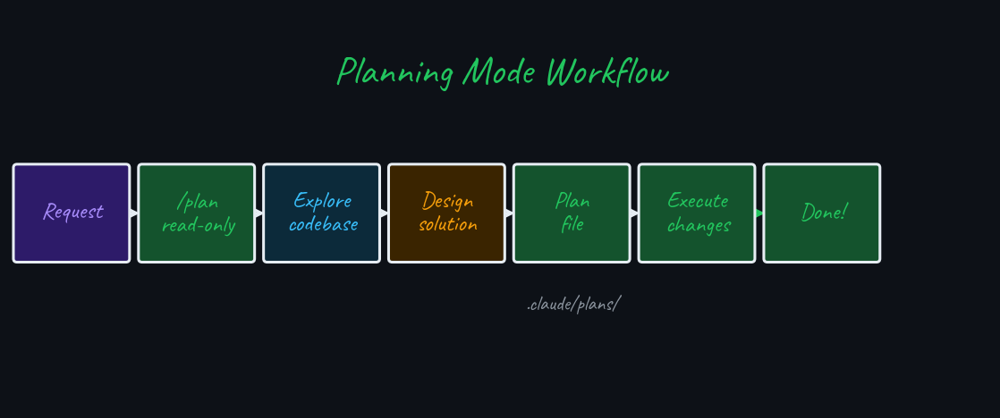{fig-align="center" fig-alt="Horizontal workflow diagram: request, /plan, explore, draft, human review, execute, done"}

::: {.card-green style="font-size:0.82em; margin-top:0.5em;"}
In **planning mode** Claude reads and reasons but **cannot write, edit, or delete files**. Validate the plan before any change lands.
:::

## When Planning Mode Pays Off {.smaller}

| Situation | Without Planning | With Planning |
|-----------|-----------------|---------------|
| Refactor across 20 files | Broken imports, partial changes | Coherent strategy, clean execution |
| Add auth to existing app | Picks wrong pattern for codebase | Existing patterns understood first |
| Multi-service change | Inconsistent API contracts | All surfaces identified upfront |
| Mysterious bug | Treats symptoms, not cause | Root-cause analysis before editing |

::: {.card-amber .card-compact style="font-size:0.78em;"}
**Rule of thumb** · if the task touches >3 files or crosses service boundaries, plan first. ~5 min of planning saves 1–2 hours of rework.
:::

## How to Brief Claude for Planning {.smaller}

:::: {.columns}

::: {.column width="50%"}

::: {.card-amber .card-compact style="font-size:0.82em;"}
**Avoid**

Treating planning as a multi-round negotiation. Annotating and re-annotating a plan is overhead you are managing instead of work Claude is doing.
:::

:::

::: {.column width="50%"}

::: {.card-green .card-compact style="font-size:0.82em;"}
**Do this instead**

Front-load clarity: state intent, constraints, and acceptance criteria upfront. Let Claude draft the plan. Either approve it or give one round of targeted feedback — then execute.
:::

:::

::::

::: {.card-blue .card-compact style="font-size:0.78em; margin-top: 0.4em;"}
**Pro tip** · persist the approved plan in `plan.md`. It survives `/compact` and context resets — use it as a progress checklist, not a negotiation document.
:::

# Trust the Model

> *"Claude Code is a reasoning engine. Give it intent, not step-by-step instructions."*

## Define the What, Not the How {.smaller}

:::: {.columns}

::: {.column width="50%"}

::: {.card-amber .card-compact}
**Over-specified**

*"First read auth.ts. Then check the test file. Then look for mocks. Then write a test for login using the existing mock pattern."*

Step-by-step instructions limit Claude's ability to explore and adapt.
:::

:::

::: {.column width="50%"}

::: {.card-green .card-compact}
**Clear acceptance criteria**

*"Add unit tests for the auth module. Done when: all public functions covered, edge cases tested, conventions followed, `pnpm test` passes."*

Define *what* done looks like. Claude figures out *how*.
:::

:::

::::

::: {.card-blue .card-compact style="font-size:0.78em; margin-top:0.4em;"}
**Mental model** · you are the product manager, Claude is the senior engineer. Claude Code already follows patterns, runs tests, and loops on failures.
:::

## The One Prompting Rule That Still Matters {.smaller}

::: {.card-blue style="font-size:0.88em; margin-bottom: 0.8em;"}
Claude Code already follows codebase patterns, runs tests, and loops on failures by default. You don't need to tell it how to be an agent — it *is* one.
:::

The one thing the model can't infer is **your definition of done**.

::: {.card-green .card-compact style="font-size:0.85em;"}
**End every task with acceptance criteria** · *"Done when: (1) tests pass, (2) no lint errors, (3) PR description written."* This prevents premature stopping and gives Claude a clear finish line.
:::

# CLI over MCPs

> *"Not all integrations are equal. The right integration is the one that uses fewer tokens and less complexity."*

## CLI vs MCP Token Cost {.smaller}

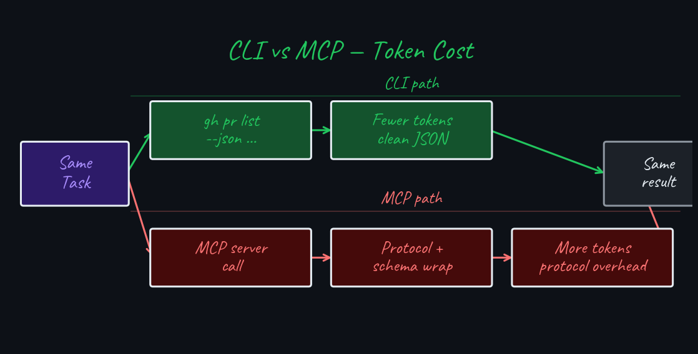{fig-align="center" fig-alt="Side-by-side diagram comparing CLI path (fewer tokens, clean JSON) versus MCP path (more tokens, protocol overhead) for the same task"}

## CLI vs MCP Decision Guide {.smaller}

| Situation | Prefer CLI | Prefer MCP |
|-----------|-----------|------------|
| **GitHub PRs / issues** | `gh pr list` — minimal tokens | Real-time webhooks needed |
| **Database queries** | `psql -c "SELECT..."` — direct | Connection pool / auth managed |
| **Jira / Linear** | `curl` + API key — simple | OAuth, token refresh required |
| **File operations** | Native `Read`/`Write`/`Bash` | Almost never needed |
| **Complex auth flows** | When API is simple | SSO, multi-step OAuth |

::: {.card-green .card-compact style="font-size:0.78em;"}
**Default rule** · if a CLI tool (`gh`, `psql`, `curl`, `kubectl`) can do the job, use `Bash`. Reach for MCP only when persistent auth, rate-limits, or real-time events are required.
:::

# Quality Guardrails

> *"An agent that can write code can also write bad code. Scaffolding is what keeps quality up when you hand the keyboard to a machine."*

## The Risk of Unconstrained Agents {.smaller}

:::: {.columns}

::: {.column width="50%"}

::: {.card-amber .card-compact style="font-size:0.82em;"}
**Without guardrails**

- Skips tests; inconsistent style across files
- No CI enforcement; conventions drift
- Bad tool calls can delete untracked files
:::

:::

::: {.column width="50%"}

::: {.card-green .card-compact style="font-size:0.82em;"}
**With guardrails**

- CLAUDE.md codifies non-negotiable rules
- Local QA catches errors before commit
- Quality is structural, not prompt-dependent
:::

:::

::::

::: {.card-blue .card-compact style="font-size:0.75em;"}
**Key insight** · the agent is only as disciplined as your tooling forces it to be. Guardrails make output trustworthy.
:::

## Three-Layer Quality Scaffold {.smaller}

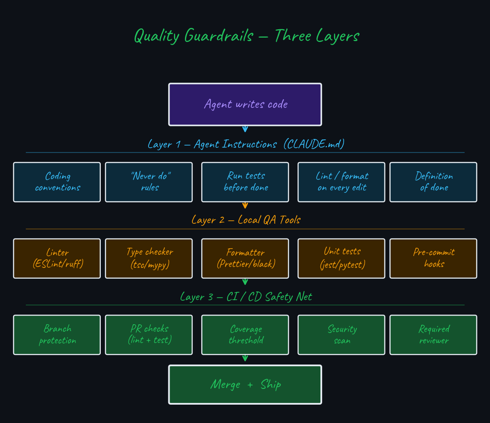{fig-align="center" fig-alt="Three-layer diagram: agent instructions in CLAUDE.md, local QA tools (lint/type/test), and CI/CD safety net"}

## CLAUDE.md as a Quality Contract {.smaller}

:::: {.columns}

::: {.column width="52%"}

::: {.terminal-box}
<pre><code># CLAUDE.md — Quality Rules

## Non-Negotiables
- Never commit with failing tests
- Never skip lint / type checks
- Never use `any` in TypeScript
- Never push directly to main

## Definition of Done
1. pnpm test passes
2. pnpm lint passes
3. pnpm typecheck passes
4. PR description written
</code></pre>
:::

:::

::: {.column width="48%"}

::: {.card-green .card-compact style="font-size:0.82em;"}
**Agent behaviour** · Claude reads these rules every turn. CLAUDE.md makes the quality bar *explicit and permanent* rather than relying on per-prompt instructions.
:::

:::

::::

## Hooks — Automated Validation {.smaller}

:::: {.columns}

::: {.column width="52%"}

::: {.terminal-box}
<pre><code># .claude/settings.json
{
  "hooks": {
    "PostToolUse": [{
      "matcher": "*",
      "hooks": [{
        "type": "command",
        "command": "pnpm lint --fix"
      }]
    }]
  }
}
</code></pre>
:::

:::

::: {.column width="48%"}

::: {.card-green .card-compact style="font-size:0.82em;"}
**What hooks do** · run shell commands automatically at lifecycle events — no per-prompt reminder needed.
:::

::: {.card-subtle .card-compact style="font-size:0.78em; margin-top: 0.4em;"}
**Four events** · `PreToolUse` · `PostToolUse` · `Stop` · `UserPromptSubmit`
:::

::: {.card-blue .card-compact style="font-size:0.78em; margin-top: 0.4em;"}
**Use cases** · auto-lint after every edit · run typecheck before stopping · block dangerous tool calls · log all file writes
:::

:::

::::

# Git Worktrees

> *"When two Claude sessions edit the same files, you don't get double the speed — you get merge conflicts. Worktrees give each session its own universe."*

## Why Parallel Sessions Need Isolation {.smaller}

:::: {.columns}

::: {.column width="50%"}

::: {.card-amber .card-compact}
**Without worktrees**

- Two sessions share the same working directory
- Uncommitted changes bleed across sessions
- One context reset can overwrite the other's work
- Stash/pop gymnastics just to switch tasks
:::

:::

::: {.column width="50%"}

::: {.card-green .card-compact}
**With worktrees**

- Each session gets its own directory and branch
- Edits, builds, and tool calls are fully isolated
- Shared commit history and remote connections
- Merge when both are done — on your schedule
:::

:::

::::

::: {.card-blue .card-compact style="font-size:0.78em;"}
**Key insight** · a git worktree is a second checkout of the same repo — same `.git/` database, different working tree. Claude Code manages them with a single flag.
:::

## Worktrees — How They Work {.smaller}

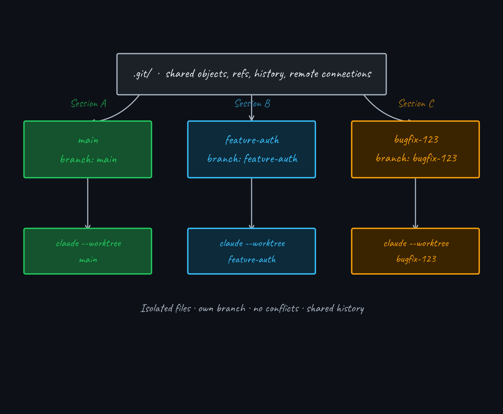{fig-align="center" fig-alt="Diagram showing a single shared .git/ object store at the top with three isolated worktree directories and three parallel Claude Code sessions below"}

## Using Worktrees with Claude Code {.smaller}

:::: {.columns}

::: {.column width="52%"}

::: {.terminal-box}
<pre><code># Create a worktree + start Claude
$ claude -w feature-auth

# Second terminal — another task
$ claude -w bugfix-123

# Or ask Claude mid-session
&gt; work in a worktree
</code></pre>
:::

:::

::: {.column width="48%"}

::: {.card-green .card-compact style="font-size:0.82em;"}
**Isolation by design** · each session gets its own branch and working directory — edits, builds, and tool calls are fully contained.
:::

::: {.card-blue .card-compact style="font-size:0.78em; margin-top:0.4em;"}
**Pro tip** · add your worktree directories to `.gitignore` — they appear as untracked files without it.
:::

::: {.card-subtle .card-compact style="font-size:0.78em; margin-top:0.4em;"}
**Manual control** · `git worktree add`, `git worktree list`, `git worktree remove` for precise placement.
:::

:::

::::

# Summary

> *"Claude Code is most powerful when you treat it as a partner, not a search engine."*

## Effective Usage: Mental Model {.smaller}

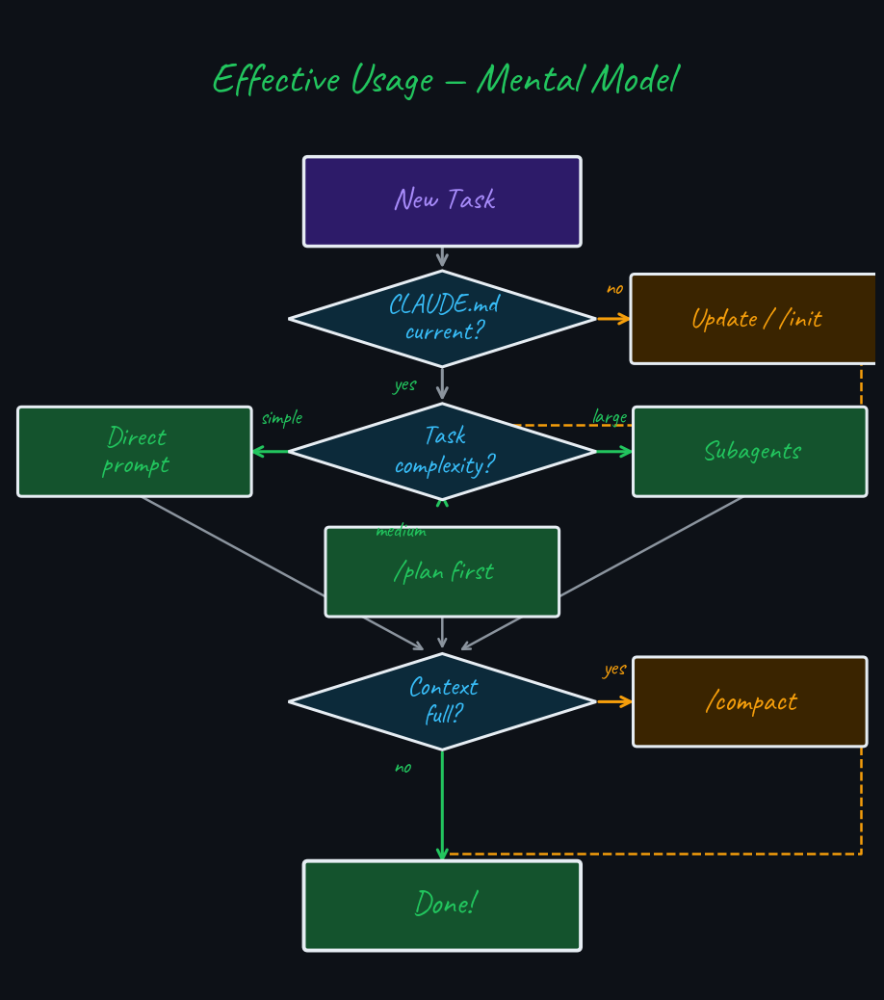{fig-align="center" fig-alt="Decision tree for effective Claude Code usage: check CLAUDE.md, assess task size, choose approach, manage context"}

::: {.card-green style="font-size:0.75em; margin-top:0.4em;"}
CLAUDE.md for memory · `/plan` for complex tasks · Subagents for parallel work · `/compact` when context fills · CLI > MCP for token efficiency · Intent + acceptance criteria over instructions · Hooks for automated validation
:::

## Resources {.smaller}

::: {style="font-size: 0.82em;"}

- [Claude Code official documentation](https://docs.anthropic.com/en/docs/claude-code) — tools, slash commands, CLAUDE.md, subagents, planning mode
- [Claude Code best practices](https://docs.anthropic.com/en/docs/claude-code/best-practices) — prompting patterns, guardrails, context management
- [How I use Claude Code](https://boristane.com/blog/how-i-use-claude-code/) — Boris Tane — research-first workflow, real-world Claude Code patterns
- [Anthropic's guide to agentic coding](https://www.anthropic.com/engineering/claude-code-best-practices) — ReAct loop, quality scaffolding, CLI vs MCP tradeoffs

:::

## Thank You

 

::: {style="text-align: center; font-size: 0.82em; color: #8b949e; margin-bottom: 1.2em;"}
Other [slide decks](https://www.indrapatil.com/presentations/) on software engineering practices
:::

::: {style="text-align: center; font-size: 1.1em;"}

[](https://www.linkedin.com/in/indrajeet-patil-ph-d-397865174/)
&nbsp;&nbsp;&nbsp;
[](http://github.com/IndrajeetPatil)
&nbsp;&nbsp;&nbsp;
[](mailto:patilindrajeet.science@gmail.com)

:::

 

::: {.terminal-box style="max-width: 400px; margin: 0 auto;"}
<pre><code>$ claude --help
Claude Code — AI pair programmer
Use it well. Ship great software.
</code></pre>
:::
