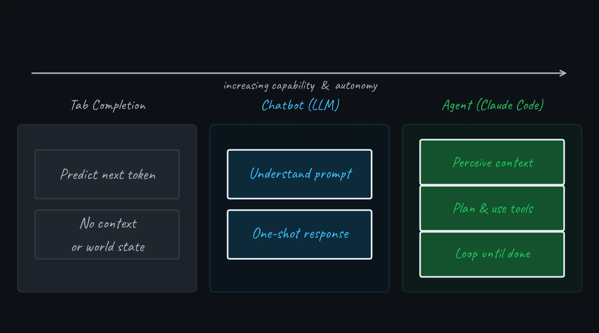
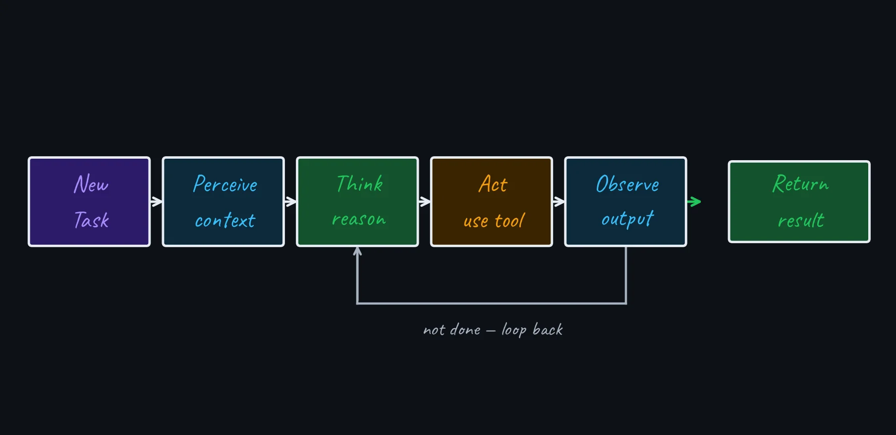
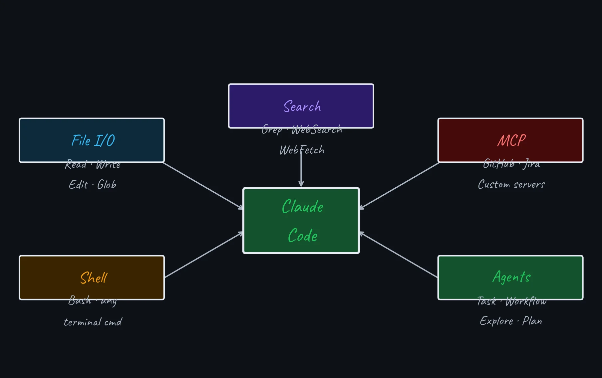
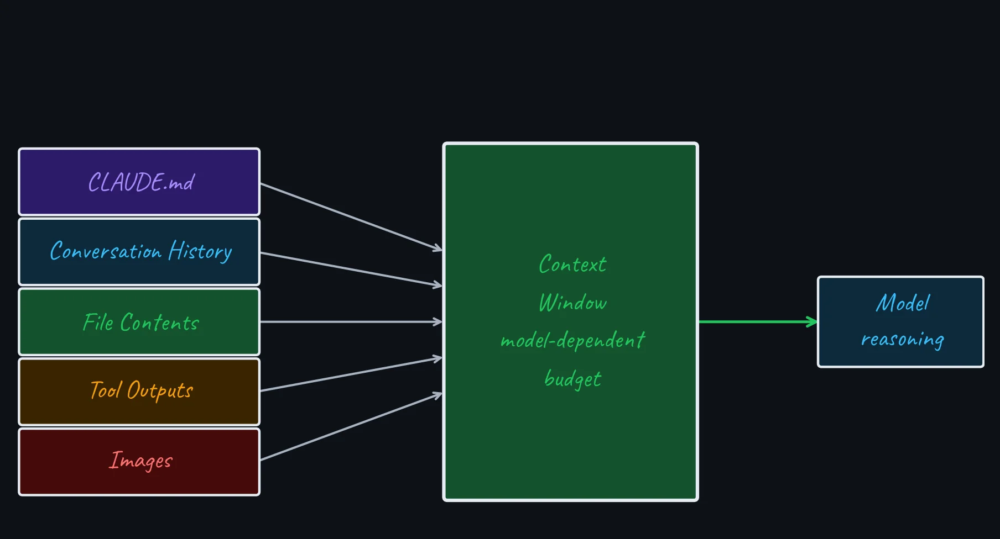
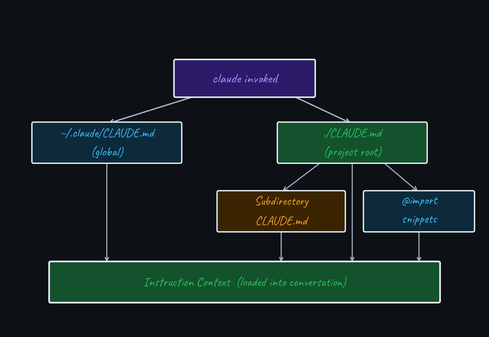
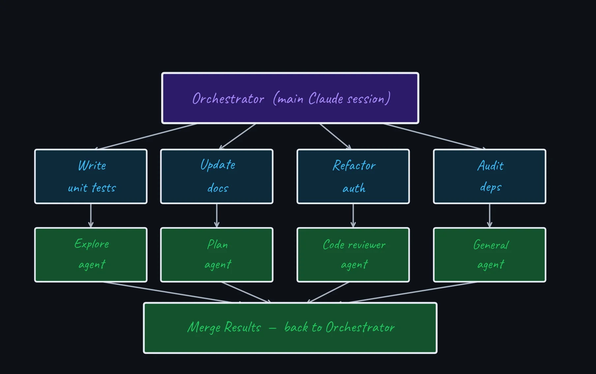
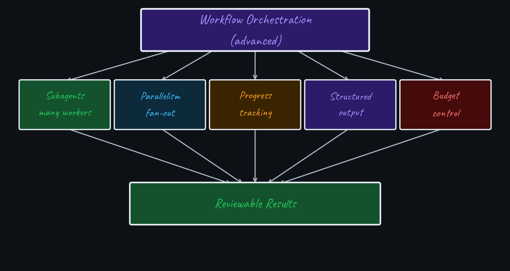
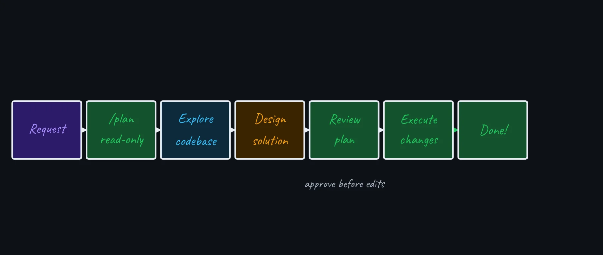
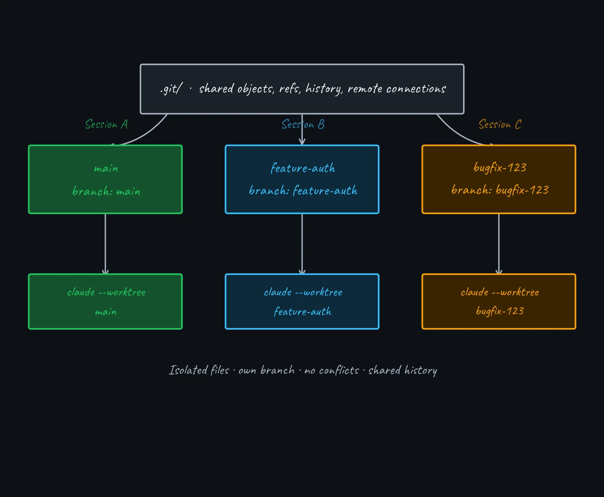
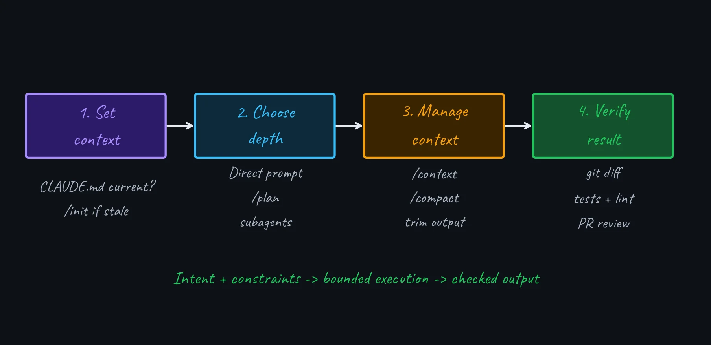

---
format:
  revealjs:
    css: style.css
    theme: black
    width: 1280
    height: 720
    margin: 0.08
    transition: fade
    slide-number: true
    code-line-numbers: false
    preview-links: auto
    keyboard: true
    touch: true
    help: true
    include-in-header: meta-tags.html
    link-external-newwindow: true
    footer: ""
keywords: ["claude-code", "ai-agents", "cli", "anthropic", "software-engineering", "workflows", "skills", "multi-platform"]
description-meta: "A comprehensive guide to using Claude Code effectively as a CLI agent. Learn about tools, skills, workflows, context management, subagents, planning mode, and more."
license: "CC0 1.0 Universal"
pagetitle: "Effective Claude Code Usage"
author-meta: "Indrajeet Patil"
date-meta: "2026-06-20"
lang: "en"
dir: "ltr"
image: "media/social-media-card.webp"
image-alt: "Preview image for Effective Claude Code Usage presentation"
canonical-url: "https://www.indrapatil.com/effective-claude-code-usage/"
---

## Effective Claude Code Usage {style="margin-top: 1.2em;"}

:::: {.columns}

::: {.column width="62%"}

::: {style="color: #38bdf8; font-weight: 600; font-size: 0.95em; letter-spacing: 0; margin-bottom: 1em;"}
From CLI to Cognitive Partner
:::

::: {style="font-size: 0.72em; color: #8b949e;"}
Indrajeet Patil &nbsp;·&nbsp; 2026
:::

::: {style="font-size: 0.65em; color: #8b949e; margin-top: 2em;"}
Source code on [GitHub](https://github.com/IndrajeetPatil/effective-claude-code-usage/)
:::

:::

::: {.column width="38%"}

::: {.terminal-box}
<pre><code>$ claude
✓ Claude Code

# Your AI pair programmer
# in the terminal

&gt; How can I help?
</code></pre>
:::

:::

::::

## What you'll learn {.smaller}

:::: {.columns}

::: {.column width="55%"}

::: {style="font-size: 0.88em;"}
- **Agents vs chatbots** — what Claude Code actually is
- **Tools, permissions & sandboxing** — capabilities and safety boundaries
- **Skills & slash commands** — reusable playbooks and session control
- **Context window** — what fills it and how to manage it
- **CLAUDE.md, auto memory & hooks** — durable context and enforcement
- **Subagents, background agents & workflows** — parallel and orchestrated work
- **Planning mode** — explore before you edit
- **Prompting** — intent over instructions
- **Git worktrees** — parallel Claude sessions
:::

:::

::: {.column width="45%"}

::: {.card-green .card-compact style="font-size: 0.88em;"}
**Goal** · turn Claude Code from a smart autocomplete into a capable cognitive partner for complex engineering tasks.
:::

::: {.card-subtle .card-compact style="margin-top: 0.5em; font-size: 0.82em;"}
**Prerequisite** · Claude Code installed; you can run `claude` in a terminal.
:::

:::

::::

# What Is Claude Code?

> *"It's not a chatbot in a terminal. It's an agent that reads, writes, searches, and executes — and loops until the task is done."*

## Claude Code is a CLI Agent {.smaller}

:::: {.columns}

::: {.column width="50%"}

::: {.card-subtle .card-compact style="margin-bottom: 0.4em; font-size: 0.85em;"}
**CLI-first** · runs in your terminal, next to your shell, files, and Git history. Also available as desktop app, IDE extensions (VS Code, JetBrains), and web app.
:::

::: {.card-subtle .card-compact style="margin-bottom: 0.4em; font-size: 0.85em;"}
**Agentic** · not one-shot Q&A — loops: perceive → plan → act → observe → repeat
:::

::: {.card-subtle .card-compact style="margin-bottom: 0.4em; font-size: 0.85em;"}
**Tool-using** · reads files, writes code, runs bash, searches the web, spawns subagents, and can run workflows when enabled
:::

::: {.card-blue .card-compact style="font-size: 0.82em;"}
**Key insight** · the model decides *which* tools to use, *in what order*, and *how many times*.
:::

:::

::: {.column width="50%"}

::: {.terminal-box}
<pre><code>$ claude "add unit tests
  for src/auth.ts"

● Reading src/auth.ts
● Scanning test patterns
● Writing tests/auth.test.ts
● Running: npm test

✓ 12 tests passing
</code></pre>
:::

:::

::::

# Agents vs. Everything Else

> *"The difference between a chatbot and an agent is the difference between giving advice and doing the work."*

## Intelligence Spectrum {.smaller}

{fig-align="center" fig-alt="Three-column diagram showing the intelligence spectrum from tab completion to chatbot to agent"}

## ReAct Agent Loop {.smaller}

{fig-align="center" fig-alt="Diagram showing the ReAct agent loop: perceive, think, act, observe, repeat"}

::: {.card-amber style="font-size:0.82em; margin-top:0.4em;"}
Claude Code can run many tool calls in one turn: read code, inspect test output, make changes, and re-run checks before it stops.
:::

# Tools & Capabilities

> *"A tool is a function the model can call. The model decides when — and how many times."*

## Tool Ecosystem {.smaller}

{fig-align="center" fig-alt="Hub-and-spoke diagram showing Claude Code connected to File I/O, Shell, Search, Agents, and MCP tools"}

## Tool Categories {.smaller}

| Category | Enables |
|----------|---------|
| **File I/O** | Read any file; create or surgically modify code |
| **Pattern Search** | Find files by name; search content by regex |
| **Shell** | Run tests, git, npm, docker — any terminal command |
| **Web** | Fetch docs, read changelogs, search answers |
| **Agents** | Spawn subagents, isolate context, and run workflow orchestration when available |
| **[MCP](https://code.claude.com/docs/en/mcp)** | GitHub PRs, Jira tickets, Postgres, and more |

::: {.card-blue .card-compact style="font-size:0.78em;"}
**Permissions + sandboxing** · prompts depend on the active permission mode and rules. Sandboxed Bash can run automatically inside OS-enforced boundaries; explicit deny rules still apply. Configure both with [`/permissions`](https://code.claude.com/docs/en/permissions) and [`/sandbox`](https://code.claude.com/docs/en/sandboxing).
:::

## Choose a Permission Mode {.smaller}

| Mode | Runs without asking | Best fit |
|------|----------------------|----------|
| **Manual** | Reads only | Getting started; sensitive work |
| **Accept edits** | Reads + file edits | Iterating on code you will review |
| **Plan** | Reads only | Explore before implementation |
| **Auto** | Everything, with background safety checks | Default on Pro/Max/Team; long tasks |
| **Don't ask** | Only pre-approved tools | Locked-down CI and scripts |
| **Bypass** | Everything | Isolated containers or VMs only |

::: {.card-amber .card-compact style="font-size:0.78em; margin-top:0.4em;"}
**Defense in depth** · permission rules decide what Claude may attempt; the sandbox enforces filesystem and network boundaries for Bash. In auto mode a classifier model reviews actions in your place — it cuts prompts but does not replace your review of sensitive work.
:::

::: {style="font-size:0.55em; text-align:center; margin-top:0.35em;"}
Sources: [Permission modes](https://code.claude.com/docs/en/permission-modes) · [Sandboxing](https://code.claude.com/docs/en/sandboxing)
:::

# Skills & Slash Commands

> *"The `/` menu is a launcher. The action type tells you how Claude will execute it."*

## [`/` Actions](https://code.claude.com/docs/en/commands) — Know What You Are Running {.smaller}

:::: {.columns}

::: {.column width="50%"}

::: {style="font-size: 0.88em;"}
The `/` menu combines built-in commands, bundled skills, workflows, plugin actions, and MCP prompts. Skills are reusable instructions that load on demand; many can activate from their description, but `/verify` and `/code-review` run only when you invoke them.
:::

| Action | Kind · purpose |
|--------|----------------|
| `/code-review` | Skill · correctness review |
| `/simplify` | Skill · apply cleanup fixes |
| `/verify` | Skill · run and observe the change |
| `/run` | Skill · launch and drive the app |

:::

::: {.column width="50%"}

| Action | Kind · purpose |
|--------|----------------|
| `/deep-research` | Workflow · cited research |
| `/security-review` | Built-in · audit branch diff |
| `/init` | Built-in · generate CLAUDE.md |
| `/review` | Built-in · fast, read-only PR review |

::: {.card-green .card-compact style="font-size:0.78em; margin-top:0.8em;"}
**Install-dependent** · availability varies by version, plan, platform, plugins, and MCP servers. Use `/help` for commands and `/skills` for loaded skills.
:::

:::

::::

## [Slash Commands](https://code.claude.com/docs/en/commands) — Session Control {.smaller}

:::: {.columns}

::: {.column width="50%"}

**Session & Context**

| Command | Purpose |
|---------|---------|
| `/clear` | Reset conversation history |
| `/compact` | Compress history, keep summary |
| `/context` | Inspect context usage and heavy inputs |
| `/rewind` | Restore or summarize from a checkpoint |
| `/goal` | Keep working until a condition holds |
| `/usage` | Show usage and limit breakdown |

:::

::: {.column width="50%"}

**Modes & Control**

| Command | Purpose |
|---------|---------|
| `/plan` | Enter planning mode |
| `/permissions` | Manage allow, ask, and deny rules |
| `/sandbox` | Configure OS-enforced Bash isolation |
| `/model` | Switch Claude model |
| `/help` | List all commands |
| `/workflows` | Watch live workflow progress |

::: {.card-amber .card-compact style="font-size:0.78em; margin-top:0.5em;"}
**Commands move fast** · use `/help` as the source of truth for your install. `/cost` and `/stats` are current aliases for `/usage`.
:::

:::

::::

# Context Window

> *"The context window is finite. What's in it decides what Claude can reason about."*

## What Fills the Context? {.smaller}

{fig-align="center" fig-alt="Diagram showing five inputs flowing into the context window: CLAUDE.md, history, files, tool outputs, images"}

:::: {.columns}

::: {.column width="50%"}
::: {.card-amber .card-compact style="font-size:0.78em;"}
**Fills fast** · large tool outputs (full files, verbose logs) consume tokens rapidly.
:::
:::

::: {.column width="50%"}
::: {.card-green .card-compact style="font-size:0.78em;"}
**Fix** · Claude can compact long sessions, but you still control the inputs. Use `/compact`, limit reads to relevant files, and trim verbose bash output.
:::
:::

::::

# CLAUDE.md & Auto Memory

> *"CLAUDE.md is durable instruction context; auto memory is Claude's local notebook."*

## How [CLAUDE.md](https://code.claude.com/docs/en/memory) Is Loaded {.smaller}

{fig-align="center" fig-alt="Diagram showing how global, project-root, subdirectory CLAUDE.md files and @imports merge into the system prompt"}

## CLAUDE.md Anatomy {.smaller}

:::: {.columns}

::: {.column width="60%"}

::: {.terminal-box}
<pre><code># My Project CLAUDE.md

## Stack
TypeScript monorepo, Node 22, pnpm

## Conventions
- ESM only (no require())
- Tests: Vitest + @testing-library
- Branch: feat/&lt;ticket&gt;-description

## Commands
- Test:  pnpm test
- Build: pnpm build

## Never
- Push directly to main
- Commit .env files
</code></pre>
:::

:::

::: {.column width="40%"}

::: {.card-green style="font-size:0.85em;"}
**Auto-generate**

Run `/init` in any repo — Claude inspects the codebase and writes a CLAUDE.md for you. Edit it to add conventions and "never do" rules.
:::

::: {.card-subtle style="font-size:0.82em; margin-top:0.6em;"}
**Keep it lean** · include only commands, conventions, decisions, and gotchas Claude cannot infer from the repo. Use `/context` to confirm the file loaded.
:::

::: {.card-blue style="font-size:0.78em; margin-top:0.6em;"}
**Auto memory** · Claude saves reusable learnings per repository and shares them across its worktrees. Audit, edit, or disable the plain Markdown notes through `/memory`.
:::

:::

::::

## [Hooks](https://code.claude.com/docs/en/hooks) — Automated Validation {.smaller}

:::: {.columns}

::: {.column width="52%"}

::: {.terminal-box}
<pre><code># .claude/settings.json
{
  "hooks": {
    "PostToolUse": [{
      "matcher": "Edit",
      "hooks": [{
        "type": "command",
        "command": "pnpm lint"
      }]
    }]
  }
}
</code></pre>
:::

:::

::: {.column width="48%"}

::: {.card-green .card-compact style="font-size:0.82em;"}
**What hooks do** · run shell commands automatically at lifecycle events — no per-prompt reminder needed.
:::

::: {.card-subtle .card-compact style="font-size:0.78em; margin-top: 0.4em;"}
**Key events** · `PreToolUse` · `PostToolUse` · `Stop` · `UserPromptSubmit` — and more
:::

::: {.card-blue .card-compact style="font-size:0.78em; margin-top: 0.4em;"}
**Use cases** · lint after edits · run typecheck before stopping · block risky bash commands · log file writes
:::

::: {.card-amber .card-compact style="font-size:0.78em; margin-top: 0.4em;"}
**Keep them scoped** · prefer narrow matchers and non-mutating checks unless automatic edits are truly intentional.
:::

:::

::::

## Memory Is Context, Not Enforcement {.smaller}

:::: {.columns}

::: {.column width="50%"}

::: {.card-green .card-compact style="font-size:0.82em;"}
**CLAUDE.md** · you write durable project instructions: non-obvious commands, conventions, workflow rules, architecture decisions, and gotchas.
:::

::: {.card-blue .card-compact style="font-size:0.82em; margin-top:0.5em;"}
**Auto memory** · Claude writes local, per-repository learnings. Only the first 200 lines or 25 KB of its `MEMORY.md` index load at startup; topic files load on demand.
:::

::: {.card-amber .card-compact style="font-size:0.78em; margin-top:0.4em;"}
**Neither is a hard guardrail** · concise, specific instructions improve adherence, but use permission deny rules or hooks when an action must be blocked or a check must always run.
:::

:::

::: {.column width="50%"}

::: {.terminal-box}
<pre><code># In a Claude Code session
&gt; /context
  Memory files:
  + ~/.claude/CLAUDE.md
  + ./CLAUDE.md

&gt; /memory
  Project instructions
  Auto memory: on
  Open memory folder

# Review notes like code:
# prune stale or conflicting facts
</code></pre>
:::

:::

::::

::: {style="font-size:0.55em; text-align:center; margin-top:0.4em;"}
Source: [Claude Code memory documentation](https://code.claude.com/docs/en/memory)
:::

# Subagents & Workflows

> *"Subagents handle parallel work. Workflows are for the cases where simple fan-out is not enough."*

## [Subagent](https://code.claude.com/docs/en/sub-agents) Orchestration {.smaller}

{fig-align="center" fig-alt="Diagram showing orchestrator fanning out to four parallel subagents and merging results"}

## Choose the Right Parallel Primitive {.smaller}

:::: {.columns}

::: {.column width="50%"}

::: {.card-green .card-compact style="font-size:0.82em;"}
[**Subagents**]{style="font-size:0.95em;"}

Focused side tasks inside one session. Use when exploration or logs would clutter the main context; results return as a summary.
:::

::: {.card-blue .card-compact style="font-size:0.82em; margin-top:0.5em;"}
[**Background agents**]{style="font-size:0.95em;"}

Independent sessions you dispatch and monitor with `claude agents`. Useful when you want to hand off several tasks and check back later. **Research preview.**
:::

:::

::: {.column width="50%"}

::: {.card-amber .card-compact style="font-size:0.82em;"}
[**Agent teams**]{style="font-size:0.95em;"}

Peer sessions with a shared task list and direct messaging. Use only when workers must coordinate with each other. **Experimental and disabled by default.**
:::

::: {.card-subtle .card-compact style="font-size:0.82em; margin-top:0.5em;"}
[**Dynamic workflows**]{style="font-size:0.95em;"}

Scripted orchestration for many agents, cross-checks, resumability, or repeatable control flow. Use after a task outgrows a few subagents.
:::

:::

::::

::: {.card-blue .card-compact style="font-size:0.78em; margin-top: 0.4em;"}
**Default** · start with one agent. Explicitly ask for a subagent, worktree isolation, a background session, a team, or a workflow when that coordination model materially helps.
:::

::: {style="font-size:0.55em; text-align:center; margin-top:0.4em;"}
Source: [Run agents in parallel](https://code.claude.com/docs/en/agents)
:::

## Workflows — Advanced Orchestration {.smaller}

{fig-align="center" fig-alt="Diagram showing advanced workflow orchestration coordinating subagents, parallelism, progress tracking, structured output, and reviewable results"}

::: {.card-green .card-compact style="font-size:0.78em; margin-top:0.3em;"}
**Advanced automation** · dynamic workflows move orchestration into a readable JavaScript script that runs in the background. Use `/workflows` to inspect progress and save a successful run for reuse.
:::

## Workflow Patterns — Use Sparingly {.smaller}

| Pattern | Use when | Simpler alternative |
|---------|----------|--------------------|
| **Adversarial verify** | A high-risk review needs independent challenge | One subagent + manual review |
| **Judge panel** | Several viable designs need comparison | Ask for tradeoffs first |
| **Loop-until-dry** | You need repeated search until no new findings | One targeted verification pass |
| **Pipeline** | Many items need the same multi-stage treatment | Script + one Claude pass |

::: {.card-blue .card-compact style="font-size:0.78em; margin-top:0.4em;"}
**Rule of thumb** · use a few subagents for turn-by-turn delegation; use a workflow when the plan itself needs repeatable loops, branching, cross-checking, or dozens of workers.
:::

::: {style="font-size:0.55em; text-align:center; margin-top:0.4em;"}
Source: [Dynamic workflows](https://code.claude.com/docs/en/workflows)
:::

# Planning Mode

> *"Explore first. Edit second."*

## [Planning Mode](https://code.claude.com/docs/en/permission-modes) Workflow {.smaller}

{fig-align="center" fig-alt="Horizontal workflow diagram: request, /plan, explore, draft, human review, execute, done"}

::: {.card-green style="font-size:0.82em; margin-top:0.5em;"}
In **planning mode** Claude reads files and proposes an approach before edits happen. Start it with `/plan` or `claude --permission-mode plan`, then review the plan before execution.
:::

## When Planning Mode Pays Off {.smaller}

| Situation | Without Planning | With Planning |
|-----------|-----------------|---------------|
| Refactor across 20 files | Broken imports, partial changes | Coherent strategy, clean execution |
| Add auth to existing app | Picks wrong pattern for codebase | Existing patterns understood first |
| Multi-service change | Inconsistent API contracts | All surfaces identified upfront |
| Mysterious bug | Treats symptoms, not cause | Root-cause analysis before editing |

::: {.card-amber .card-compact style="font-size:0.78em;"}
**Rule of thumb** · plan when the approach is uncertain, the change spans multiple files, or the code is unfamiliar. If you can describe the diff in one sentence, direct execution is usually enough.
:::

::: {.card-blue .card-compact style="font-size:0.78em;"}
**Pro tip** · front-load clarity: state intent, constraints, and acceptance criteria upfront. Let Claude draft the plan. Approve it or give one round of feedback — then execute.
:::

## Keep the Blast Radius Small {.smaller}

:::: {.columns}

::: {.column width="50%"}

::: {.card-green .card-compact}
[**Before broad edits**]{style="font-size:0.95em;"}

- Use `/plan` for cross-file changes
- Start a worktree for parallel sessions
- State files, commands, and acceptance criteria
- Ask for a diff summary before commit
:::

:::

::: {.column width="50%"}

::: {.card-amber .card-compact}
[**Before accepting work**]{style="font-size:0.95em;"}

- Inspect `git diff`
- Run tests and lint
- Check generated artifacts
- Review the PR like any teammate's work
:::

:::

::::

::: {.card-blue .card-compact style="font-size:0.78em; margin-top:0.4em;"}
**Principle** · let Claude move quickly inside boundaries you can verify.
:::

# Delegate Intent, Verify Work

> *"Claude Code is an execution engine. Give it intent, constraints, and a finish line; then verify what changed."*

## Define the What, Not the How {.smaller}

:::: {.columns}

::: {.column width="50%"}

::: {.card-amber .card-compact}
**Over-specified**

*"First read auth.ts. Then check the test file. Then look for mocks. Then write a test for login using the existing mock pattern."*

Step-by-step instructions limit Claude's ability to explore and adapt.
:::

:::

::: {.column width="50%"}

::: {.card-green .card-compact}
**Intent + acceptance criteria**

*"Add unit tests for the auth module. Done when: all public functions covered, edge cases tested, conventions followed, `pnpm test` passes."*

Define *what* done looks like. Claude figures out *how*.
:::

:::

::::

::: {.card-blue .card-compact style="font-size:0.78em; margin-top:0.4em;"}
**The prompting rule that still matters most** · Claude can explore the codebase, choose tools, and loop on failures, but it cannot read your mind. State **your definition of done**, then verify those criteria before accepting the result.
:::

::: {.card-green .card-compact style="font-size:0.78em; margin-top:0.3em;"}
**Mental model** · delegate the work, but keep ownership of the result. Inspect the diff, run checks, and review the PR before merging.
:::

# Git Worktrees

> *"When two Claude sessions edit the same files, you don't get double the speed — you get merge conflicts. Worktrees give each session its own universe."*

## Why Parallel Sessions Need Isolation {.smaller}

:::: {.columns}

::: {.column width="50%"}

::: {.card-amber .card-compact}
**Without worktrees**

- Two sessions share the same working directory
- Uncommitted changes bleed across sessions
- One context reset can overwrite the other's work
- Stash/pop gymnastics just to switch tasks
:::

:::

::: {.column width="50%"}

::: {.card-green .card-compact}
**With worktrees**

- Each session gets its own directory and branch
- Edits, builds, and tool calls are fully isolated
- Shared commit history and remote connections
- Merge when both are done — on your schedule
:::

:::

::::

::: {.card-blue .card-compact style="font-size:0.78em;"}
**Key insight** · a git worktree is a second checkout of the same repo — same `.git/` database, different working tree. Claude Code manages them with a single flag.
:::

## [Worktrees](https://code.claude.com/docs/en/worktrees) — How They Work {.smaller}

{fig-align="center" fig-alt="Diagram showing a single shared .git/ object store at the top with three isolated worktree directories and three parallel Claude Code sessions below"}

:::: {.columns}

::: {.column width="50%"}
::: {.card-green .card-compact style="font-size:0.78em;"}
**Usage** · `claude --worktree feature-auth` creates an isolated worktree and starts Claude in it. `-w` is the short alias.
:::
:::

::: {.column width="50%"}
::: {.card-blue .card-compact style="font-size:0.78em;"}
**Pro tip** · add `.claude/worktrees/` to `.gitignore`. Use `.worktreeinclude` to copy selected gitignored setup files such as `.env` into new worktrees.
:::
:::

::::

# Summary

> *"Claude Code is most powerful when you treat it as a partner, not a search engine."*

## Effective Usage: Mental Model {.smaller}

{fig-align="center" fig-alt="Four-step mental model for effective Claude Code usage: set context, choose depth, manage context, verify result"}

::: {.card-green style="font-size:0.75em; margin-top:0.4em;"}
CLAUDE.md for durable instructions · `/plan` for complex tasks · Worktrees for isolation · Subagents for focused side work · Skills for repeatable actions · `/compact` when context fills · Intent + acceptance criteria · Diff + tests before acceptance
:::

## Resources {.smaller}

::: {style="font-size: 0.82em;"}

- [Claude Code official documentation](https://code.claude.com/docs/en/overview) — tools, skills, workflows, subagents, planning mode
- [Claude Code best practices](https://code.claude.com/docs/en/best-practices) — prompting patterns, guardrails, context management
- [Anthropic's guide to agentic coding](https://www.anthropic.com/engineering/claude-code-best-practices) — ReAct loop, quality scaffolding, CLI vs MCP tradeoffs

:::

## Thank You

 

::: {style="text-align: center; font-size: 0.82em; color: #8b949e; margin-bottom: 1.2em;"}
Other [slide decks](https://www.indrapatil.com/presentations/) on software engineering practices
:::

::: {style="text-align: center; font-size: 1.1em;"}

<a class="deck-icon-link" href="https://www.linkedin.com/in/indrajeet-patil-ph-d-397865174/" aria-label="LinkedIn"></a>
&nbsp;&nbsp;&nbsp;
<a class="deck-icon-link" href="http://github.com/IndrajeetPatil" aria-label="GitHub"></a>
&nbsp;&nbsp;&nbsp;
<a class="deck-icon-link" href="mailto:patilindrajeet.science@gmail.com" aria-label="Email"></a>

:::

 

::: {.terminal-box style="max-width: 400px; margin: 0 auto;"}
<pre><code>$ claude --help
Claude Code — AI pair programmer
Use it well. Ship great software.
</code></pre>
:::
