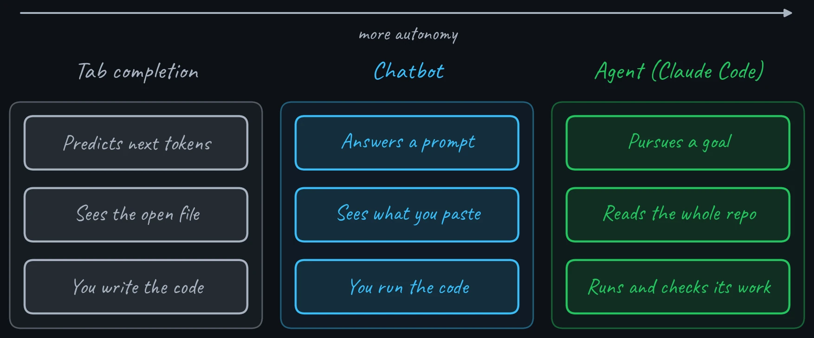
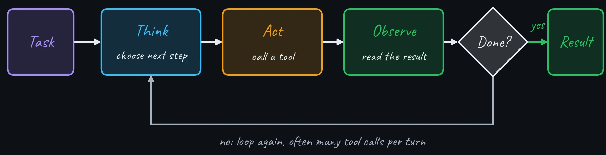
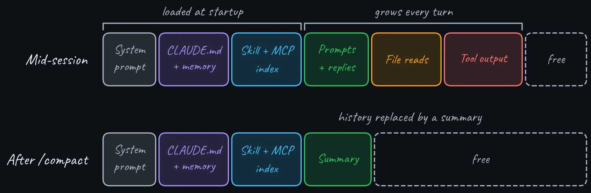
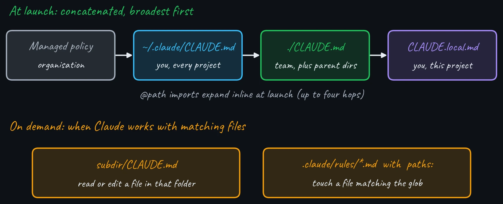
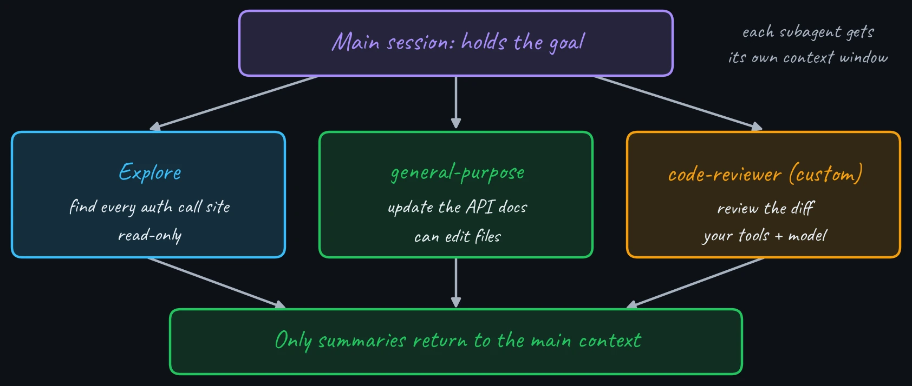
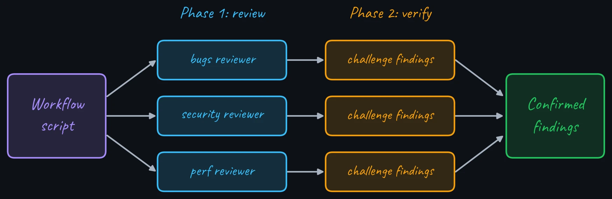
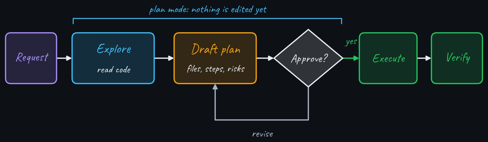
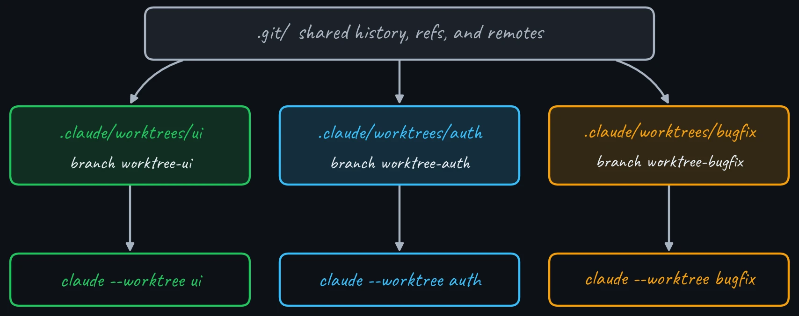
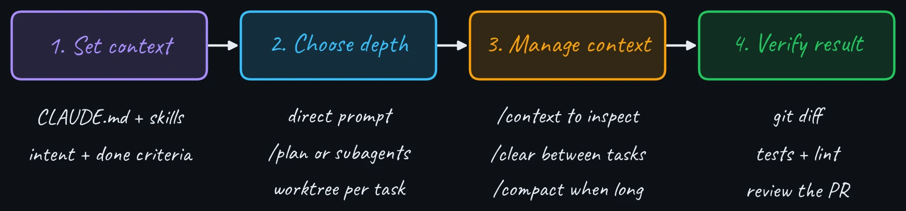

---
format:
  revealjs:
    css: style.css
    theme: black
    # Use CSS image sizing; RevealJS stretching can collapse lazy images in scroll view.
    auto-stretch: false
    width: 1280
    height: 720
    margin: 0.08
    transition: fade
    revealjs-plugins:
      - a11y
    revealjs-a11y:
      # 0.2.3's menus introduce ARIA failures; retain our slide-menu handling.
      slide-menu-a11y: false
      menu: false
      # Use the extension's core accessibility fixes without extra UI/shortcuts.
      font-size-controls: false
      font-selection: false
      text-spacing: false
      transcript: false
      slide-change-cue: false
    slide-number: true
    code-line-numbers: false
    preview-links: auto
    keyboard: true
    touch: true
    help: true
    include-in-header: meta-tags.html
    include-after-body: accessibility.html
    link-external-newwindow: true
    footer: ""
execute:
  echo: true
  eval: false
keywords: ["claude-code", "ai-agents", "cli", "anthropic", "software-engineering", "workflows", "skills", "multi-platform"]
description-meta: "A comprehensive guide to using Claude Code effectively as a CLI agent. Learn about tools, skills, workflows, context management, subagents, planning mode, and more."
license: "CC0 1.0 Universal"
pagetitle: "Effective Claude Code Usage"
author-meta: "Indrajeet Patil"
date-meta: "2026-10-07"
lang: "en"
dir: "ltr"
image: "media/social-media-card.webp"
image-alt: "Preview image for Effective Claude Code Usage presentation"
canonical-url: "https://www.indrapatil.com/effective-claude-code-usage/"
jupyter: python3
---

## Effective Claude Code Usage {style="margin-top: 1.2em;"}

:::: {.columns}

::: {.column width="62%"}

::: {style="color: #38bdf8; font-weight: 600; font-size: 0.95em; letter-spacing: 0; margin-bottom: 1em;"}
From CLI to Cognitive Partner
:::

::: {style="font-size: 0.72em; color: #8b949e;"}
Indrajeet Patil &nbsp;·&nbsp; 2026
:::

::: {style="font-size: 0.65em; color: #8b949e; margin-top: 2em;"}
Source code on [GitHub](https://github.com/IndrajeetPatil/effective-claude-code-usage/)
:::

:::

::: {.column width="38%"}

::: {.terminal-box}
<pre><code>$ claude
✓ Claude Code

# Your AI pair programmer
# in the terminal

&gt; How can I help?
</code></pre>
:::

:::

::::

## What you'll learn {.smaller}

:::: {.columns}

::: {.column width="55%"}

::: {.tight-list style="font-size: 1.05em;"}
- **Agents vs chatbots** — what Claude Code actually is
- **Tools and permissions** — capabilities and safety boundaries
- **Skills & slash commands** — use them, then write your own
- **Context window** — what fills it and how to manage it
- **CLAUDE.md, memory, and hooks** — durable context and enforcement
- **Subagents and workflows** — parallel and orchestrated work
- **Planning mode** — explore before you edit
- **Prompting** — intent over instructions
- **Worktrees and `claude -p`** — parallel sessions and automation
:::

:::

::: {.column width="45%"}

::: {.card-green .card-compact style="font-size: 0.95em;"}
**Goal** · turn Claude Code from a smart autocomplete into a capable cognitive partner for complex engineering tasks.
:::

::: {.card-subtle .card-compact style="margin-top: 0.5em; font-size: 0.9em;"}
**Prerequisite** · Claude Code installed; you can run `claude` in a terminal.
:::

:::

::::

# What Is Claude Code?

> *"It's not a chatbot in a terminal. It's an agent that reads, writes, searches, and executes — and loops until the task is done."*

## Claude Code is a CLI Agent {.smaller}

:::: {.columns}

::: {.column width="50%"}

::: {.card-subtle .card-compact style="margin-bottom: 0.4em; font-size: 0.85em;"}
**CLI-first** · runs in your terminal, next to your shell, files, and Git history. Also available as desktop app, IDE extensions (VS Code, JetBrains), and web app.
:::

::: {.card-subtle .card-compact style="margin-bottom: 0.4em; font-size: 0.85em;"}
**Agentic** · not one-shot Q&A — loops: perceive → plan → act → observe → repeat
:::

::: {.card-subtle .card-compact style="margin-bottom: 0.4em; font-size: 0.85em;"}
**Tool-using** · reads files, writes code, runs bash, searches the web, spawns subagents, and can run workflows when enabled
:::

::: {.card-blue .card-compact style="font-size: 0.82em;"}
**Key insight** · the model decides *which* tools to use, *in what order*, and *how many times*.
:::

:::

::: {.column width="50%"}

::: {.terminal-box}
<pre><code>$ claude "add unit tests
  for src/auth.ts"

● Reading src/auth.ts
● Scanning test patterns
● Writing tests/auth.test.ts
● Running: npm test

✓ 12 tests passing
</code></pre>
:::

:::

::::

# Agents vs. Everything Else

> *"The difference between a chatbot and an agent is the difference between giving advice and doing the work."*

## Intelligence Spectrum {.smaller}

{fig-align="center" fig-alt="Three columns ordered by increasing autonomy. Tab completion predicts next tokens, sees the open file, and you write the code. A chatbot answers a prompt, sees what you paste, and you run the code. An agent such as Claude Code pursues a goal, reads the whole repository, and runs and checks its own work."}

## ReAct Agent Loop {.smaller}

{fig-align="center" fig-alt="ReAct agent loop: a task flows into think, act, and observe steps, then a done check. If not done, it loops back to think; if done, it returns a result."}

::: {.card-amber .card-compact style="font-size:0.82em; margin-top:0.6em;"}
**Why it matters** · the loop only ends well if Claude can tell when it is done. Give it a check to run — tests, a build, a screenshot — and it will iterate against that signal instead of stopping at "looks right".
:::

# Tools & Capabilities

> *"A tool is a function the model can call. The model decides when — and how many times."*

## Tool Categories {.smaller}

| Category | Tools | Enables |
|----------|-------|---------|
| **File I/O** | `Read` · `Write` · `Edit` | Read any file; create or surgically modify code |
| **Search** | `Glob` · `Grep` | Find files by name; search content by regex |
| **Shell** | `Bash` | Run tests, git, npm, docker — any terminal command |
| **Web** | `WebFetch` · `WebSearch` | Fetch docs, read changelogs, search answers |
| **Agents** | `Agent` · `Workflow` | Spawn subagents, isolate context, orchestrate workflows |
| **[MCP](https://code.claude.com/docs/en/mcp)** | Server-defined | GitHub PRs, Jira tickets, Postgres, and more |

::: {.card-blue .card-compact style="font-size:0.78em;"}
**Permissions + sandboxing** · prompts depend on the active permission mode and rules. Sandboxed Bash can run automatically inside OS-enforced boundaries; explicit deny rules still apply. Configure both with [`/permissions`](https://code.claude.com/docs/en/permissions) and [`/sandbox`](https://code.claude.com/docs/en/sandboxing).
:::

## Choose a Permission Mode {.smaller}

| Mode | Runs without asking | Best fit |
|------|----------------------|----------|
| **Manual** | Reads only | Getting started; sensitive work |
| **Accept edits** | Reads, file edits, common filesystem commands | Iterating on code you will review |
| **Plan** | Reads only | Explore before implementation |
| **Auto** | Classifier-approved actions (still blocks risky ones) | Default in recent versions; long tasks |
| **Don't ask** | Only pre-approved tools | Locked-down CI and scripts |
| **Bypass** | Everything | Isolated containers or VMs only |

::: {.card-amber .card-compact style="font-size:0.78em; margin-top:0.4em;"}
**Switch with `Shift+Tab`** · it cycles manual → accept edits → plan → auto mid-session. Permission rules decide what Claude may attempt; the sandbox enforces filesystem and network boundaries for Bash. In auto mode a classifier reviews actions in your place — it cuts prompts but does not replace your review of sensitive work.
:::

::: {style="font-size:0.55em; text-align:center; margin-top:0.35em;"}
Sources: [Permission modes](https://code.claude.com/docs/en/permission-modes) · [Sandboxing](https://code.claude.com/docs/en/sandboxing)
:::

# Skills & Slash Commands

> *"The `/` menu is a launcher. The action type tells you how Claude will execute it."*

## [`/` Actions](https://code.claude.com/docs/en/commands) — Know What You Are Running {.smaller}

:::: {.columns}

::: {.column width="50%"}

::: {style="font-size: 0.88em;"}
The `/` menu combines built-in commands, bundled skills, workflows, plugin actions, and MCP prompts. Skills are reusable instructions that load on demand; many can activate from their description, but `/verify` and `/code-review` run only when you invoke them.
:::

| Action | Kind · purpose |
|--------|----------------|
| `/code-review` | Skill · correctness review |
| `/simplify` | Skill · apply cleanup fixes |
| `/verify` | Skill · run and observe the change |
| `/run` | Skill · launch and drive the app |

:::

::: {.column width="50%"}

| Action | Kind · purpose |
|--------|----------------|
| `/deep-research` | Workflow · cited research |
| `/security-review` | Built-in · audit branch diff |
| `/init` | Built-in · generate CLAUDE.md |
| `/review` | Built-in · fast, read-only PR review |

::: {.card-green .card-compact style="font-size:0.78em; margin-top:0.8em;"}
**Install-dependent** · availability varies by version, plan, platform, plugins, and MCP servers. Use `/help` for commands and `/skills` for loaded skills.
:::

:::

::::

## Write Your Own [Skill](https://code.claude.com/docs/en/skills) {.smaller}

:::: {.columns}

::: {.column width="55%"}

::: {.terminal-box}
<pre><code># .claude/skills/release-notes/SKILL.md
---
description: Draft release notes from merged
  PRs. Use when preparing a release.
disable-model-invocation: true
allowed-tools: Bash(gh pr list *) Read
---

1. List PRs merged since the last tag.
2. Group them: features, fixes, chores.
3. Write CHANGELOG.md in house style.
</code></pre>
:::

:::

::: {.column width="45%"}

::: {.card-green .card-compact style="font-size:0.85em;"}
**When to write one** · you have pasted the same multi-step instructions into a prompt more than twice.
:::

::: {.card-subtle .card-compact style="font-size:0.82em; margin-top:0.4em;"}
**Where** · `.claude/skills/<name>/` for the team (commit it), `~/.claude/skills/<name>/` for you. The folder name becomes `/name`.
:::

::: {.card-blue .card-compact style="font-size:0.82em; margin-top:0.4em;"}
**Who invokes it** · Claude loads a skill when its `description` matches the task. Set `disable-model-invocation: true` for actions with side effects, so they run only when you type `/name`.
:::

::: {.card-amber .card-compact style="font-size:0.78em; margin-top:0.4em;"}
**Cheap until used** · only descriptions sit in context; the body loads on invocation. Existing `.claude/commands/*.md` files keep working as skills.
:::

:::

::::

::: {style="font-size:0.55em; text-align:center; margin-top:0.4em;"}
Source: [Extend Claude with skills](https://code.claude.com/docs/en/skills)
:::

## [Slash Commands](https://code.claude.com/docs/en/commands) — Session Control {.smaller}

:::: {.columns}

::: {.column width="50%"}

**Session & Context**

| Command | Purpose |
|---------|---------|
| `/clear` | Reset conversation history |
| `/compact` | Compress history, keep summary |
| `/context` | Inspect context usage and heavy inputs |
| `/rewind` | Restore or summarize from a checkpoint |
| `/goal` | Keep working until a condition holds |
| `/usage` | Show usage and limit breakdown |

:::

::: {.column width="50%"}

**Modes & Control**

| Command | Purpose |
|---------|---------|
| `/plan` | Enter planning mode |
| `/permissions` | Manage allow, ask, and deny rules |
| `/sandbox` | Configure OS-enforced Bash isolation |
| `/model` | Switch Claude model |
| `/help` | List all commands |
| `/workflows` | Watch live workflow progress |

::: {.card-amber .card-compact style="font-size:0.78em; margin-top:0.5em;"}
**Commands move fast** · use `/help` as the source of truth for your install. `/cost` and `/stats` are current aliases for `/usage`.
:::

:::

::::

# Context Window

> *"The context window is finite. What's in it decides what Claude can reason about."*

## What Fills the Context? {.smaller}

{fig-align="center" fig-alt="Two context-window bars. Mid-session: system prompt, CLAUDE.md plus memory, and the skill and MCP index are loaded at startup; prompts and replies, file reads, and tool output grow every turn, leaving little free space. After /compact: the startup items remain, history is replaced by a short summary, and most of the window is free."}

:::: {.columns}

::: {.column width="50%"}
::: {.card-amber .card-compact style="font-size:0.8em;"}
**Fills fast** · full-file reads and verbose logs dominate. As the window fills, earlier instructions get less attention.
:::
:::

::: {.column width="50%"}
::: {.card-green .card-compact style="font-size:0.8em;"}
**Fix** · `/clear` between unrelated tasks; `/compact focus on X` to steer the summary; send broad searches to a subagent so only its findings come back.
:::
:::

::::

# CLAUDE.md, Memory & Hooks

> *"CLAUDE.md is durable instruction context; auto memory is Claude's local notebook; hooks are the rules that always run."*

## How [CLAUDE.md](https://code.claude.com/docs/en/memory) Is Loaded {.smaller}

{fig-align="center" fig-alt="At launch, Claude Code concatenates instruction files from broadest to most specific: managed policy, ~/.claude/CLAUDE.md, ./CLAUDE.md with parent directories, then CLAUDE.local.md; @path imports expand inline up to four hops. On demand, subdirectory CLAUDE.md files load when Claude reads or edits files in that folder, and .claude/rules files with paths globs load when Claude touches matching files."}

::: {.card-blue .card-compact style="font-size:0.8em; margin-top:0.6em;"}
**Scale without bloat** · imports organise a long file but still load at launch. Move guidance that only matters for part of the repo into subdirectory files or path-scoped rules.
:::

::: {style="font-size:0.55em; text-align:center; margin-top:0.4em;"}
Source: [How Claude remembers your project](https://code.claude.com/docs/en/memory)
:::

## CLAUDE.md Anatomy {.smaller}

:::: {.columns}

::: {.column width="60%"}

::: {.terminal-box}
<pre><code># My Project CLAUDE.md

## Stack
TypeScript monorepo, Node 22, pnpm

## Conventions
- ESM only (no require())
- Tests: Vitest + @testing-library
- Branch: feat/&lt;ticket&gt;-description

## Commands
- Test:  pnpm test
- Build: pnpm build

## Never
- Push directly to main
- Commit .env files
</code></pre>
:::

:::

::: {.column width="40%"}

::: {.card-green style="font-size:0.85em;"}
**Auto-generate**

Run `/init` in any repo — Claude inspects the codebase and writes a CLAUDE.md for you. Edit it to add conventions and "never do" rules.
:::

::: {.card-subtle style="font-size:0.82em; margin-top:0.6em;"}
**Keep it lean** · aim for under 200 lines. Include only commands, conventions, decisions, and gotchas Claude cannot infer from the repo.
:::

::: {.card-blue style="font-size:0.82em; margin-top:0.6em;"}
**Test each line** · would removing it cause a mistake? If not, cut it. When two rules contradict, Claude may follow either.
:::

:::

::::

## Memory Is Context, Not Enforcement {.smaller}

:::: {.columns}

::: {.column width="50%"}

::: {.card-green .card-compact style="font-size:0.82em;"}
**CLAUDE.md** · you write durable project instructions: non-obvious commands, conventions, workflow rules, architecture decisions, and gotchas.
:::

::: {.card-blue .card-compact style="font-size:0.82em; margin-top:0.5em;"}
**Auto memory** · Claude writes local, per-repository learnings. Only the first 200 lines or 25 KB of its `MEMORY.md` index load at startup; topic files load on demand.
:::

::: {.card-amber .card-compact style="font-size:0.78em; margin-top:0.4em;"}
**Neither is a hard guardrail** · concise, specific instructions improve adherence, but use permission deny rules or hooks when an action must be blocked or a check must always run.
:::

:::

::: {.column width="50%"}

::: {.terminal-box}
<pre><code># In a Claude Code session
&gt; /context
  Memory files:
  + ~/.claude/CLAUDE.md
  + ./CLAUDE.md

&gt; /memory
  Project instructions
  Auto memory: on
  Open memory folder

# Review notes like code:
# prune stale or conflicting facts
</code></pre>
:::

:::

::::

::: {style="font-size:0.55em; text-align:center; margin-top:0.4em;"}
Source: [Claude Code memory documentation](https://code.claude.com/docs/en/memory)
:::

## [Hooks](https://code.claude.com/docs/en/hooks) — Automated Validation {.smaller}

:::: {.columns}

::: {.column width="52%"}

::: {.terminal-box}
<pre><code># .claude/settings.json
{
  "hooks": {
    "PostToolUse": [{
      "matcher": "Edit",
      "hooks": [{
        "type": "command",
        "command": "pnpm lint"
      }]
    }]
  }
}
</code></pre>
:::

:::

::: {.column width="48%"}

::: {.card-green .card-compact style="font-size:0.82em;"}
**What hooks do** · run shell commands automatically at lifecycle events — no per-prompt reminder needed.
:::

::: {.card-subtle .card-compact style="font-size:0.78em; margin-top: 0.4em;"}
**Key events** · `PreToolUse` · `PostToolUse` · `Stop` · `UserPromptSubmit` — and more
:::

::: {.card-blue .card-compact style="font-size:0.78em; margin-top: 0.4em;"}
**Use cases** · lint after edits · run typecheck before stopping · block risky bash commands · log file writes
:::

::: {.card-amber .card-compact style="font-size:0.78em; margin-top: 0.4em;"}
**Keep them scoped** · prefer narrow matchers and non-mutating checks unless automatic edits are truly intentional.
:::

:::

::::

# Subagents & Workflows

> *"Subagents handle parallel work. Workflows are for the cases where simple fan-out is not enough."*

## [Subagent](https://code.claude.com/docs/en/sub-agents) Orchestration {.smaller}

{fig-align="center" fig-alt="The main session, which holds the goal, delegates to three subagents that each get their own context window: Explore finds every auth call site and is read-only; general-purpose updates the API docs and can edit files; a custom code-reviewer reviews the diff with your chosen tools and model. Only their summaries return to the main context."}

::: {.card-amber .card-compact style="font-size:0.8em; margin-top:0.6em;"}
**Custom subagents** · a Markdown file in `.claude/agents/` with `name`, `description`, and optional `tools` and `model`. Claude delegates when the description matches; `/agents` manages them.
:::

## Choose the Right Parallel Primitive {.smaller}

:::: {.columns}

::: {.column width="50%"}

::: {.card-green .card-compact style="font-size:0.82em;"}
[**Subagents**]{style="font-size:0.95em;"}

Focused side tasks inside one session. Use when exploration or logs would clutter the main context; results return as a summary.
:::

::: {.card-blue .card-compact style="font-size:0.82em; margin-top:0.5em;"}
[**Background agents**]{style="font-size:0.95em;"}

Independent sessions you dispatch and monitor with `claude agents`. Useful when you want to hand off several tasks and check back later. **Research preview.**
:::

:::

::: {.column width="50%"}

::: {.card-amber .card-compact style="font-size:0.82em;"}
[**Agent teams**]{style="font-size:0.95em;"}

Peer sessions with a shared task list and direct messaging. Use only when workers must coordinate with each other. **Experimental and disabled by default.**
:::

::: {.card-subtle .card-compact style="font-size:0.82em; margin-top:0.5em;"}
[**Dynamic workflows**]{style="font-size:0.95em;"}

Scripted orchestration for many agents, cross-checks, resumability, or repeatable control flow. Use after a task outgrows a few subagents.
:::

:::

::::

::: {.card-blue .card-compact style="font-size:0.78em; margin-top: 0.4em;"}
**Default** · start with one agent. Explicitly ask for a subagent, worktree isolation, a background session, a team, or a workflow when that coordination model materially helps.
:::

::: {style="font-size:0.55em; text-align:center; margin-top:0.4em;"}
Source: [Run agents in parallel](https://code.claude.com/docs/en/agents)
:::

## Workflows — Advanced Orchestration {.smaller}

{fig-align="center" fig-alt="Example workflow: a script runs phase 1, where bugs, security, and performance reviewers work in parallel, then phase 2, where each reviewer's findings are independently challenged, and only confirmed findings come out."}

::: {.card-green .card-compact style="font-size:0.8em; margin-top:0.6em;"}
**Orchestration as code** · the control flow above lives in a readable JavaScript script that runs in the background. `/workflows` shows live progress; save a run that worked so the team can reuse it.
:::

## Workflow Patterns — Use Sparingly {.smaller}

| Pattern | Use when | Simpler alternative |
|---------|----------|--------------------|
| **Adversarial verify** | A high-risk review needs independent challenge | One subagent + manual review |
| **Judge panel** | Several viable designs need comparison | Ask for tradeoffs first |
| **Loop-until-dry** | You need repeated search until no new findings | One targeted verification pass |
| **Pipeline** | Many items need the same multi-stage treatment | Script + one Claude pass |

::: {.card-blue .card-compact style="font-size:0.78em; margin-top:0.4em;"}
**Rule of thumb** · use a few subagents for turn-by-turn delegation; use a workflow when the plan itself needs repeatable loops, branching, cross-checking, or dozens of workers.
:::

::: {style="font-size:0.55em; text-align:center; margin-top:0.4em;"}
Source: [Dynamic workflows](https://code.claude.com/docs/en/workflows)
:::

# Planning Mode

> *"Explore first. Edit second."*

## [Planning Mode](https://code.claude.com/docs/en/permission-modes) Workflow {.smaller}

{fig-align="center" fig-alt="Planning workflow: request, explore the code, draft a plan covering files, steps, and risks, then an approval decision. Explore and draft happen in plan mode where nothing is edited. If revised, the loop returns to the draft; if approved, Claude executes and then verifies."}

::: {.card-green .card-compact style="font-size:0.82em; margin-top:0.6em;"}
**Enter plan mode** · `/plan`, `Shift+Tab` until the status bar shows plan mode, or `claude --permission-mode plan`. Edit the plan directly or reply with feedback before approving.
:::

## When Planning Mode Pays Off {.smaller}

| Situation | Without Planning | With Planning |
|-----------|-----------------|---------------|
| Refactor across 20 files | Broken imports, partial changes | Coherent strategy, clean execution |
| Add auth to existing app | Picks wrong pattern for codebase | Existing patterns understood first |
| Multi-service change | Inconsistent API contracts | All surfaces identified upfront |
| Mysterious bug | Treats symptoms, not cause | Root-cause analysis before editing |

::: {.card-amber .card-compact style="font-size:0.78em;"}
**Rule of thumb** · plan when the approach is uncertain, the change spans multiple files, or the code is unfamiliar. If you can describe the diff in one sentence, direct execution is usually enough.
:::

::: {.card-blue .card-compact style="font-size:0.78em;"}
**Pro tip** · front-load clarity: state intent, constraints, and acceptance criteria upfront. Let Claude draft the plan. Approve it or give one round of feedback — then execute.
:::

## Keep the Blast Radius Small {.smaller}

:::: {.columns}

::: {.column width="50%"}

::: {.card-green .card-compact}
[**Before broad edits**]{style="font-size:0.95em;"}

- Use `/plan` for cross-file changes
- Start a worktree for parallel sessions
- State files, commands, and acceptance criteria
- Ask for a diff summary before commit
:::

:::

::: {.column width="50%"}

::: {.card-amber .card-compact}
[**Before accepting work**]{style="font-size:0.95em;"}

- Inspect `git diff`
- Run tests and lint
- Check generated artefacts
- Review the PR like any teammate's work
:::

:::

::::

::: {.card-blue .card-compact style="font-size:0.78em; margin-top:0.4em;"}
**Principle** · let Claude move quickly inside boundaries you can verify.
:::

# Delegate Intent, Verify Work

> *"Claude Code is an execution engine. Give it intent, constraints, and a finish line; then verify what changed."*

## Define the What, Not the How {.smaller}

:::: {.columns}

::: {.column width="50%"}

::: {.card-amber .card-compact}
**Over-specified**

*"First read auth.ts. Then check the test file. Then look for mocks. Then write a test for login using the existing mock pattern."*

Step-by-step instructions limit Claude's ability to explore and adapt.
:::

:::

::: {.column width="50%"}

::: {.card-green .card-compact}
**Intent + acceptance criteria**

*"Add unit tests for the auth module. Done when: all public functions covered, edge cases tested, conventions followed, `pnpm test` passes."*

Define *what* done looks like. Claude figures out *how*.
:::

:::

::::

::: {.card-blue .card-compact style="font-size:0.78em; margin-top:0.4em;"}
**The prompting rule that still matters most** · Claude can explore the codebase, choose tools, and loop on failures, but it cannot read your mind. State **your definition of done**, then verify those criteria before accepting the result.
:::

# Git Worktrees

> *"When two Claude sessions edit the same files, you don't get double the speed — you get merge conflicts. Worktrees give each session its own universe."*

## Why Parallel Sessions Need Isolation {.smaller}

:::: {.columns}

::: {.column width="50%"}

::: {.card-amber .card-compact}
**Without worktrees**

- Two sessions share the same working directory
- Uncommitted changes bleed across sessions
- One session's half-finished edits break the other's tests
- Stash/pop gymnastics just to switch tasks
:::

:::

::: {.column width="50%"}

::: {.card-green .card-compact}
**With worktrees**

- Each session gets its own directory and branch
- Edits, builds, and tool calls are fully isolated
- Shared commit history and remote connections
- Merge when both are done — on your schedule
:::

:::

::::

::: {.card-blue .card-compact style="font-size:0.78em;"}
**Key insight** · a git worktree is a second checkout of the same repo — same `.git/` database, different working tree. Claude Code manages them with a single flag.
:::

## [Worktrees](https://code.claude.com/docs/en/worktrees) — How They Work {.smaller}

{fig-align="center" fig-alt="One shared .git directory with history, refs, and remotes feeds three worktree directories under .claude/worktrees (ui, auth, and bugfix), each on its own worktree branch and each driven by its own claude --worktree session."}

:::: {.columns}

::: {.column width="50%"}
::: {.card-green .card-compact style="font-size:0.78em;"}
**Usage** · `claude --worktree feature-auth` creates an isolated worktree and starts Claude in it. `-w` is the short alias.
:::
:::

::: {.column width="50%"}
::: {.card-blue .card-compact style="font-size:0.78em;"}
**Pro tip** · add `.claude/worktrees/` to `.gitignore`. Use `.worktreeinclude` to copy selected gitignored setup files such as `.env` into new worktrees.
:::
:::

::::

# Automation

> *"The same agent loop runs without a terminal session: in scripts, pipelines, and CI."*

## [Run Claude Non-Interactively](https://code.claude.com/docs/en/headless) {.smaller}

:::: {.columns}

::: {.column width="55%"}

::: {.terminal-box}
<pre><code># Pipe input in, get an answer out
$ cat build.log | claude -p \
    "explain the root cause"

# Pre-approve only the tools it needs
$ claude -p "fix the failing tests" \
    --allowedTools "Bash,Read,Edit"

# Structured output for scripts
$ claude -p "summarise this PR" \
    --output-format json | jq -r .result
</code></pre>
:::

:::

::: {.column width="45%"}

::: {.card-green .card-compact style="font-size:0.82em;"}
**`-p` / `--print`** · runs one task and exits; a non-zero exit code means the run failed, so scripts can branch on it.
:::

::: {.card-blue .card-compact style="font-size:0.82em; margin-top:0.4em;"}
**Reproducible in CI** · add `--bare` to skip local hooks, plugins, MCP servers, auto memory, and CLAUDE.md; pass what you need explicitly.
:::

::: {.card-amber .card-compact style="font-size:0.82em; margin-top:0.4em;"}
**Locked down** · `--permission-mode dontAsk` denies anything not pre-approved. Keep bypass mode for disposable containers.
:::

::: {.card-subtle .card-compact style="font-size:0.78em; margin-top:0.4em;"}
**In GitHub** · [Claude Code GitHub Actions](https://code.claude.com/docs/en/github-actions) responds to `@claude` mentions in issues and PRs.
:::

:::

::::

::: {style="font-size:0.55em; text-align:center; margin-top:0.4em;"}
Source: [Run Claude Code programmatically](https://code.claude.com/docs/en/headless)
:::

# Summary

> *"Claude Code is most powerful when you treat it as a partner, not a search engine."*

## Effective Usage: Mental Model {.smaller}

{fig-align="center" fig-alt="Four-step mental model. 1, set context: CLAUDE.md and skills, intent and done criteria. 2, choose depth: direct prompt, /plan or subagents, a worktree per task. 3, manage context: /context to inspect, /clear between tasks, /compact when long. 4, verify result: git diff, tests and lint, review the PR."}

::: {.card-green .card-compact style="font-size:0.85em; margin-top:1em; text-align:center;"}
**Delegate the work, keep ownership of the result.**
:::

## Resources {.smaller}

::: {style="font-size: 1.05em;"}

- [Claude Code official documentation](https://code.claude.com/docs/en/overview) — tools, skills, workflows, subagents, planning mode
- [Claude Code best practices](https://code.claude.com/docs/en/best-practices) — prompting patterns, guardrails, context management
- [Explore the context window](https://code.claude.com/docs/en/context-window) — interactive view of what loads and when
- [Anthropic's guide to agentic coding](https://www.anthropic.com/engineering/claude-code-best-practices) — ReAct loop, quality scaffolding, CLI vs MCP trade-offs

:::

## Thank You

 

::: {style="text-align: center; font-size: 0.82em; color: #8b949e; margin-bottom: 1.2em;"}
Other [slide decks](https://www.indrapatil.com/presentations/) on software engineering practices
:::

::: {style="text-align: center; font-size: 1.1em;"}

<a class="deck-icon-link" href="https://www.linkedin.com/in/indrajeet-patil-ph-d-397865174/" aria-label="LinkedIn"></a>
&nbsp;&nbsp;&nbsp;
<a class="deck-icon-link" href="http://github.com/IndrajeetPatil" aria-label="GitHub"></a>
&nbsp;&nbsp;&nbsp;
<a class="deck-icon-link" href="mailto:patilindrajeet.science@gmail.com" aria-label="Email"></a>

:::

 

::: {.terminal-box style="max-width: 480px; margin: 0 auto;"}
<pre><code>$ claude --help
Claude Code — AI pair programmer
Use it well. Ship great software.
</code></pre>
:::
